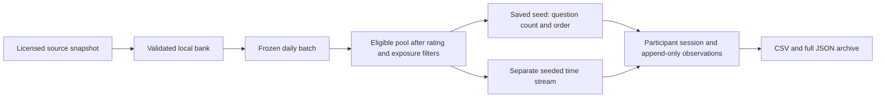

# PuzzleTrack: what we have built

Current version: **0.6.0**. Local research prototype for endgame decision making, search stopping and time conditions. This document describes implemented behavior; it does not certify the study design or measurement validity.

## The research task

Participants see endgame positions, record plausible candidate moves, choose why they stopped searching and play their final choice. A matching reference move triggers the next opponent reply automatically. One continuous timer covers the complete puzzle sequence. A completed reference sequence, an alternative immediate checkmate, a reference mismatch, timeout or participant ending the position closes the attempt.

The participant interface is titled **Chess decision study**. It displays the current position and remaining time. It does not display source ratings, future time assignments, the total number of questions, reference answers, a solved score or correctness feedback. Finished positions receive neutral feedback. Reference branching is still observable: a matching move may continue the position, while a mismatch ends it. This may allow learning even without scores.

This is a puzzle-sequence task, not a full game against a freely responding chess engine. The automatic opponent plays the source reference line.

## Implemented capabilities

| Capability | What exists now |
| --- | --- |
| Random questions | Exactly 10 questions in new local sessions; seeded puzzle selection and order without replacement. |
| Random difficulty | Standalone scheduled mode enforces exact source-band quotas: pilot 5 easy / 5 hard, with different frozen positions per participant ID. Bands are provisional. |
| Session time | One fixed scheduled limit for all 10 puzzles; professor pilot 15 minutes, draft main conditions 15/20. Existing randomized-time plans remain readable. |
| Daily source | The standalone server archives ten positions per participant and study-local date, enforcing quotas and study windows when enabled. Pilot restrictions are disabled pending review; legacy 200-position calibration batches remain separate. |
| Local bank | This workspace has 5,000 distinct legal solver positions, selected from a 64 MiB compressed prefix of the CC0 Lichess dataset. A frozen public example bank is included in Git; working copies and issuance archives stay local. |
| Exposure exclusion | Excludes positions already shown to the same participant in this browser dataset. It checks IDs and solver FEN keys, including aborted and timed-out exposures. |
| Search capture | Candidate and final-decision reports with move, step number, timestamp, elapsed time and stop reason. |
| Timing | Continuous timestamp-based countdown, deadline-normalized timeouts, per-step timings and browser presentation callbacks. |
| Move history | Actor, UCI/SAN, before/after FEN, reference match and timing for each played ply. |
| Recovery | Reload preserves the original deadline and marks an active attempt possibly interrupted. One trainer tab can control the dataset at a time. |
| Integrity log | Focus and visibility events and derived away time. These describe interruptions, not cheating. |
| Export | Participant CSV, 84 columns, plus full schema-3 JSON containing frozen source data and raw logs. |
| Validation | Checks assignments, source consistency, move-log continuity, timing, time assignments, exposure exclusions and missing measures. |
| ChessTempo collector | Separate extension workflow for manual collection/history import and matching. An optional limited metadata bridge is disabled in default builds. |

The legacy calibration bank supports 25 fresh batches of 200 when used from an empty issuance history. Refresh or enlarge the source when unused eligible positions are exhausted. Daily files are created on demand; there is no unattended download scheduler. Existing issued batches are preserved across bank updates. The extension bundles the smaller 24-item calibration pool; researchers can upload a dated daily JSON there.

## What the dataset measures

| Research quantity | Recorded evidence | Interpretation limit |
| --- | --- | --- |
| Search stopping | First candidate, subsequent candidate reports, final move and reported stop reason | Unreported thoughts are not observed. Reporting itself can change search. |
| Time | Attempt/decision timestamps, per-step elapsed milliseconds, deadlines and presentation callbacks | Browser clocks/callbacks are not hardware-calibrated onset measurements. Time is not a direct cognition measure. |
| Task performance | Solved/reference mismatch/timeout/aborted, complete move trace | A reference mismatch does not independently prove a worsened chess outcome. |
| Source difficulty | Frozen Lichess puzzle rating and rating deviation | Not calibrated local endgame difficulty or a ChessTempo rating. |
| Participant skill | Researcher-entered rating with source/scale and timestamp | The app does not test or infer the participant's skill. |
| Initial WDL regret | Archived initial tablebase responses in the 24-item starter pool | Only the first participant move; unavailable in the expanded daily bank. |
| Manual engine benchmark | Extension Dataset form, with engine/version/configuration, position reference, best/chosen scores and threshold | Researcher supplied, first-decision summary; later-step analysis needs a separate documented analysis. |

CSV first-candidate/final-choice summary fields refer to the first participant decision in a local puzzle. `candidate_count` totals reports across steps. Use `research_events` and `local_trial` for the complete step-level analysis. Missing data remains null/empty rather than becoming a zero score.

**Satisfaction of search is not an automatic label.** The intended hypothesis is stopping after a plausible move while missing a better option. A reported “satisfied” reason alone does not establish that behavior. A reference mismatch alone does not either. The study needs a prespecified combination of stopping evidence and a documented better-move benchmark.

## Skill and relative difficulty: proposed work

An initial AI skill assessment was discussed but **has not been implemented**. There is no Stockfish gameplay integration, validated baseline score, rating estimator or calibrated success-probability model.

The current `relative_difficulty` export is the legacy ChessTempo difference `problem_rating - player_rating_before`. It remains empty for local attempts. The separately entered `participant_skill_rating` is not automatically substituted, because it may come from an incompatible scale.

A future baseline could use a separate, standardized endgame assessment with fixed time conditions and positions reserved from the main study. Outcome preservation, conversion/defence success, outcome-changing mistakes and decision times could provide descriptive performance measures. Turning those into a rating comparable to source puzzle difficulty requires pilot calibration and uncertainty estimates. Winning one game against an AI with a configured Elo does not establish that Elo for the participant.

## How a session becomes reproducible



The JSON archive contains exact selected pool JSON bytes, its SHA-256, original source row fields, eligible reference pool, seed, algorithm identifiers, ordered puzzles, per-position limits, exclusions, protocol revision and collector version. Replay the saved reference pool and seed, not a newly downloaded pool with changing ratings.

The full source download and 5,000-item bank are not embedded in participant exports. Back up `data/endgame` separately if bank preparation/issuance must also be reproduced. Preserve the downloaded compressed source and its checksum for source-scan reproducibility. Review and archive the source code version/build mode with the protocol.

## Running and collecting

```sh
npm install
npm run trainer
```

Open http://localhost:8769 and keep the server running. Use the same hostname, port and browser profile for continued collection. `localhost` and `127.0.0.1` are separate browser storage origins. The server binds to the local computer, not the network.

1. Confirm the loaded source and protocol revision.
2. Enter a pseudonymous participant ID, count bounds, source rating range and time condition.
3. Optionally enter an existing skill rating and its explicit source/scale.
4. Start the session. The position remains hidden until the participant starts its timer.
5. Record candidates and final decisions; continue through the assigned positions.
6. Validate records, review warnings, export participant CSV and full JSON.
7. Archive the protocol, build/source files, bank/daily directory and any benchmark analysis.

Standalone records use browser localStorage. Extension records use Chrome extension storage. Exporting JSON does not synchronize them. Restoring a backup in the extension replaces that profile's collector store; use an isolated profile for benchmark work and retain the original archive.

## Verification and practical limits

The domain/data suite has 207 passing tests across 24 files, including legal reference sequences, randomization replay, independent time assignment, timeout normalization, backup/CSV preservation and exposure exclusions. TypeScript and build checks pass. Synthetic browser checks exercised sequence play, recovery, neutral feedback, assigned limits, daily loading and repeat exclusion. See the dated evidence in `output/research-audit`.

The bank is a prefix sample, not a representative puzzle population. The default time conditions and cognition/search definitions remain provisional. Focus signals cannot reconstruct everything during crashes/closed standalone pages. Timeout processing after reopening retains the configured deadline, but events that were never observed are not invented. Client-side solutions are inspectable, so researchers should supervise trials. Baseline skill, cross-scale relative difficulty and expanded-bank move-quality benchmarks remain open work.

Further instructions: [local study operation and bank preparation](LOCAL_ENDGAME_TRAINER.md), [data schema](DATA_SCHEMA.md), [research capture](RESEARCH_CAPTURE.md), [experiment protocol](EXPERIMENT_PROTOCOL.md).

Source/license: [Lichess open database](https://database.lichess.org/#puzzles), CC0. Move legality uses pinned chess.js 1.4.0, whose BSD license is copied into build output. Archived starter benchmarks use the [Lichess tablebase API](https://github.com/lichess-org/lila-tablebase#http-api).

Measurement definitions, warning interpretation and remaining gaps: [Measurement audit](MEASUREMENT_AUDIT.md). Validation now includes coverage/formulas and a downloadable per-attempt audit JSON.

Current local UI protocol (v0.5.3) supersedes the earlier variable-count/per-puzzle-time default: exactly 10 puzzles per session, one fixed session time including 20 minutes, random puzzle selection within researcher-chosen source-rating bounds. Legacy plans remain preserved. This historical default was superseded in v0.6.0 by exact scheduled quotas; the current draft remains unactivated.

Current standalone default (v0.6.0): professor-review pilot, exact 5-easy/5-hard quotas, participant-specific frozen batches, optional external-practice report. Main study dates/hours are unactivated. See [daily schedule and full limitations](DAILY_STUDY_SCHEDULE.md) and [professor instructions](PROFESSOR_REVIEW.md). Legacy variable counts/time and calibration sources remain for historical data/extension workflows.

The professor pilot now has an archived ten-position WDL sidecar and a read-only checksum/position/move-bound analysis pipeline. Other batches require their own benchmark preparation. [Tablebase analysis](TABLEBASE_ANALYSIS.md) documents formulas and the limitation to outcome classes.

The GitHub publication includes `examples/public-endgame-bank.json`, a 5,000-position public CC0 snapshot for reproducible setup, plus the unplayed professor pool and its benchmark sidecar. These contain source positions/provenance, not participant responses. Generated allocations and observations remain ignored. No GitHub Release is created.
